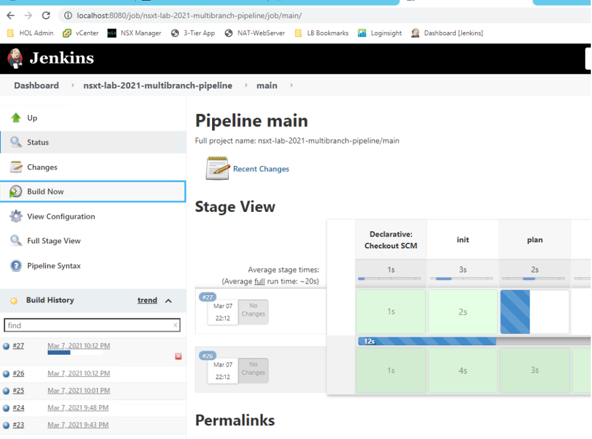

# nsxt-3.1-lab-2021

## Software Version as of 2021.3
- NSX-T 3.1
- Terraform 0.14.7
- PostgreSQL 13.2.1
- Jenkins 2.263.4

## How it works
- User wants to make a change to NSX-T, he updates the terraform files in the terraform folder.
- Commit the change.
- Jenkins will be triggered or scheduled, it applies the terraform changes.
- Terraform uses a local PostgreSQL database as the backend, credentials are hard-coded in terraform files.
- Terraform does an "init" every time, it downloads files from the Internet. This approach is OK if we use a local Terraform repo.
- Uses Jenkins multi-branch pipeline.

## Jenkins Job

